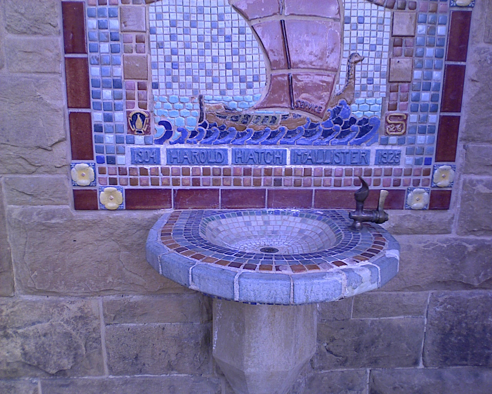
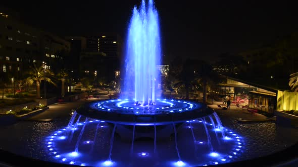
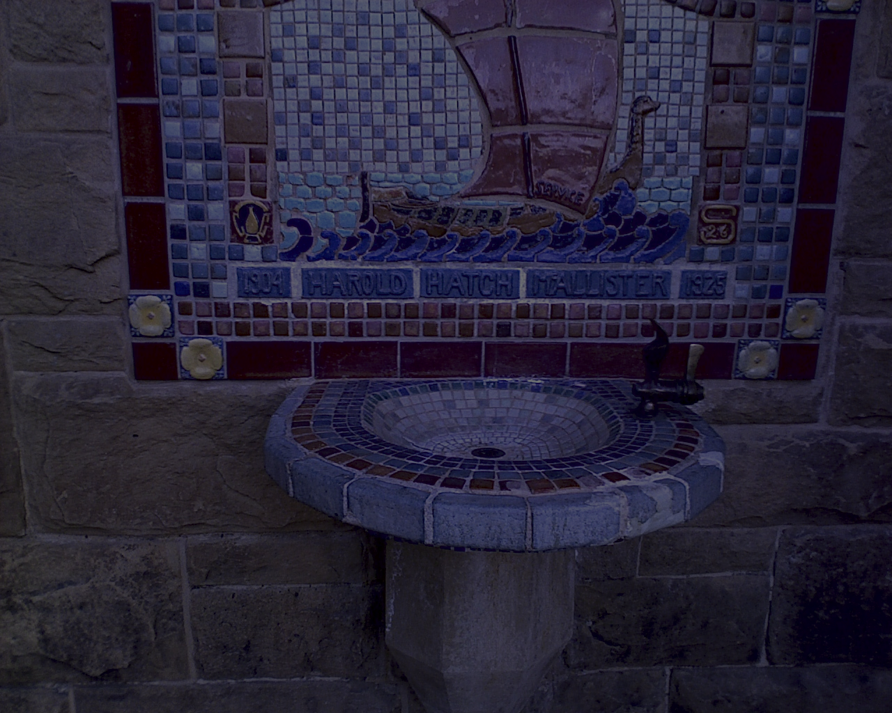

Super fast color transfer between images
==============
The code is based on <code>color_transfer</code> package: https://github.com/jrosebr1/color_transfer.  
The code can transfer a folder of images into a new color style with a color style reference image.
  
The <code>color_transfer</code> package is an OpenCV and Python implementation based (loosely) on [*Color Transfer between Images*](https://www.cs.tau.ac.il/~turkel/imagepapers/ColorTransfer.pdf) [Reinhard et al., 2001] The algorithm itself is extremely efficient (much faster than histogram based methods), requiring only the mean and standard deviation of pixel intensities for each channel in the L\*a\*b\* color space.

For more information, along with a detailed code review, [take a look at this post on original author's blog](http://www.pyimagesearch.com/2014/06/30/super-fast-color-transfer-images/).

#Requirements
- OpenCV
- NumPy

#Install
To install, make sure you have installed NumPy and compiled OpenCV with Python bindings enabled.

<!-- From there, there easiest way to install is via pip: -->

<!-- <code>$ pip install color_transfer</code> -->

#Examples
Below are some examples showing how to run the <code>group_color_transfer.py</code> demo and the associated color transfers between images.  

<code>$ python group_color_transfer.py --input_dir inputs/fountain_all --style_image style/fountain/night2.jpg --output_dir results/fountain_all_night2</code>
  

